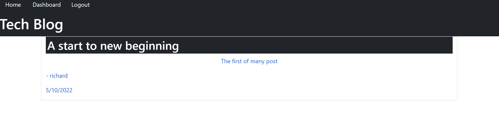

# blog-for-tech 
## Description 
The following is an application that allows the user to create an account and post blogs for others to see. Blogs can be edited and deleted if desired. Anything can be post in text form. And a timestamp is given to each blog.

# Table of Contents
- [Walkthrough](#walkthrough)
- [Prerequisites](#prerequisites)
- [Installation](#installation)
- [Test](#test)
- [License](#license)
- [Technologies](#technologies)
- [Questions](#questions)
- [Credits](#credits)

## Walkthrough
The following will be a guide that can assist you to download and start the application:
## Prerequisites
- IDE to view(preferably Visual Studio Code).
- Node.js
- MySQL
- REST API software (Insomnia)
## Installation
- Start by cloning repository.
- Navigate to the file in the terminal.
- Perform a npm install to download dependencies.
- Create and add MySql user name and password to .env file and change file name to .env.
- Create database in SQL with source db/schema.sql.
- Now the database can be seeded with "node seeds/seed.js", also changes can be made to seeds file if desired.
- start the application with node server.js or npm start.
### Test
Test can be performed in Insomnia, or similar API software. 
## License
[License: MIT](https://opensource.org/licenses/MIT) : click to learn more!
## Live site
* [click to view](https://young-woodland-61260.herokuapp.com/)
## Technologies
- Sequelize
- MySQL2
- Express.js
- Node.js
- session
## Questions
If there are questions, reach out to: Richard Ferry
* [LinkedIn](https://www.linkedin.com/in/richard-ferry-83120514b/)
* [GitHub](https://github.com/rich-f-p)
* [email](mailto:richardfpro864@gmail.com)
## Credits
- Sequelize
- MySQL2
- Express.js
- Node.js
- session